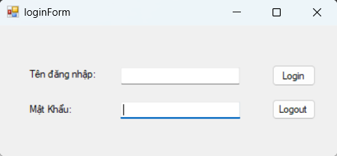

## 🖥️ Frontend (WinForms)

This project includes a **Windows Forms (WinForms) client application** to interact with the API.

### Features
- User login (JWT authentication)
- Call API from UI
- Display task list
- Create / Update / Delete tasks
- Search & filter tasks

### How it works
- WinForms sends HTTP requests to ASP.NET Core API
- API returns JSON data
- UI renders data in DataGridView

---

## 🖼️ Application Demo

---

## 🔗 System Overview

WinForms (UI) → ASP.NET Core API → SQL Server

- Frontend: WinForms (C#)
- Backend: ASP.NET Core Web API
- Database: SQL Server

---

## 📌 Highlights (CV-ready)

- Built full-stack application with **WinForms + ASP.NET Core API**
- Implemented JWT authentication between frontend and backend
- Designed RESTful API and consumed it in desktop application
- Managed SQL Server database using ADO.NET
- Developed CRUD features with real-time UI interaction
